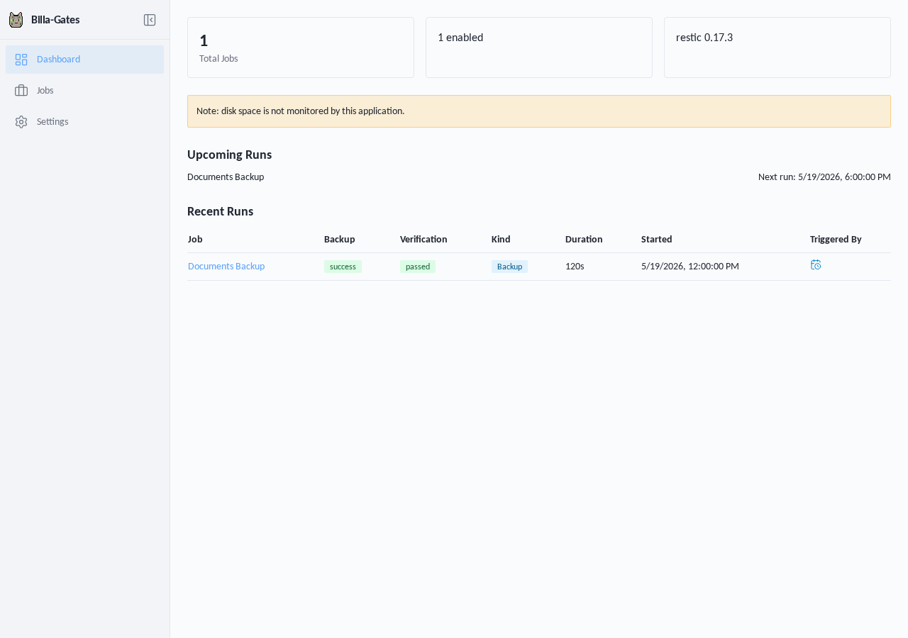
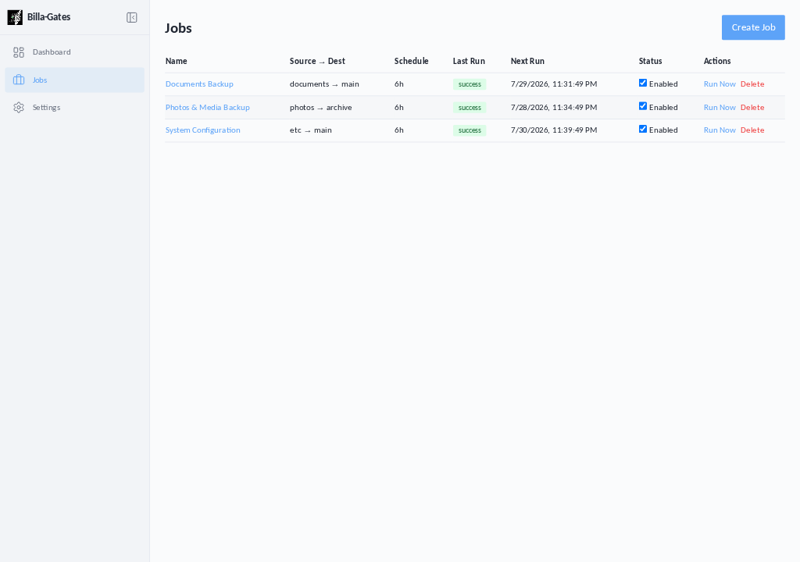
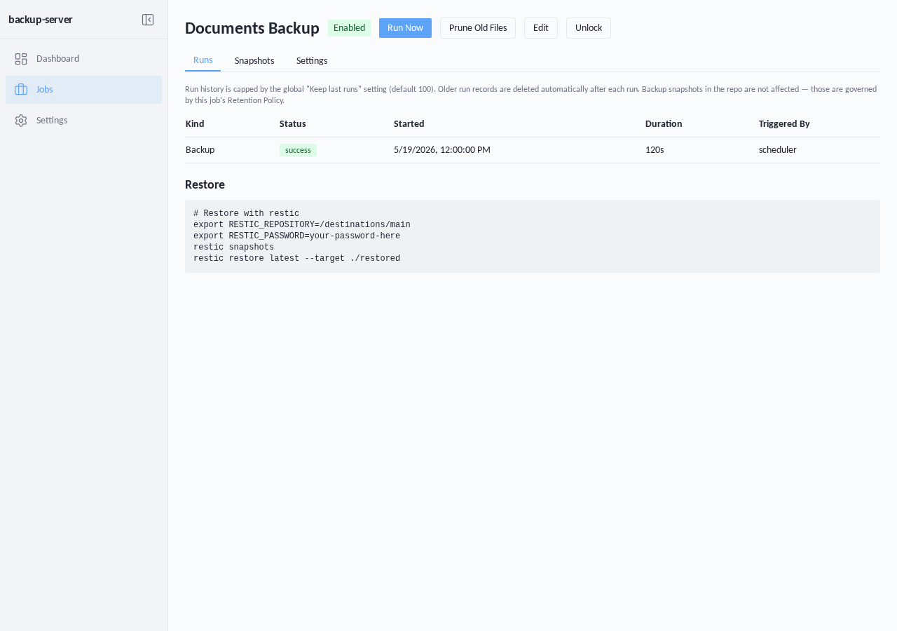
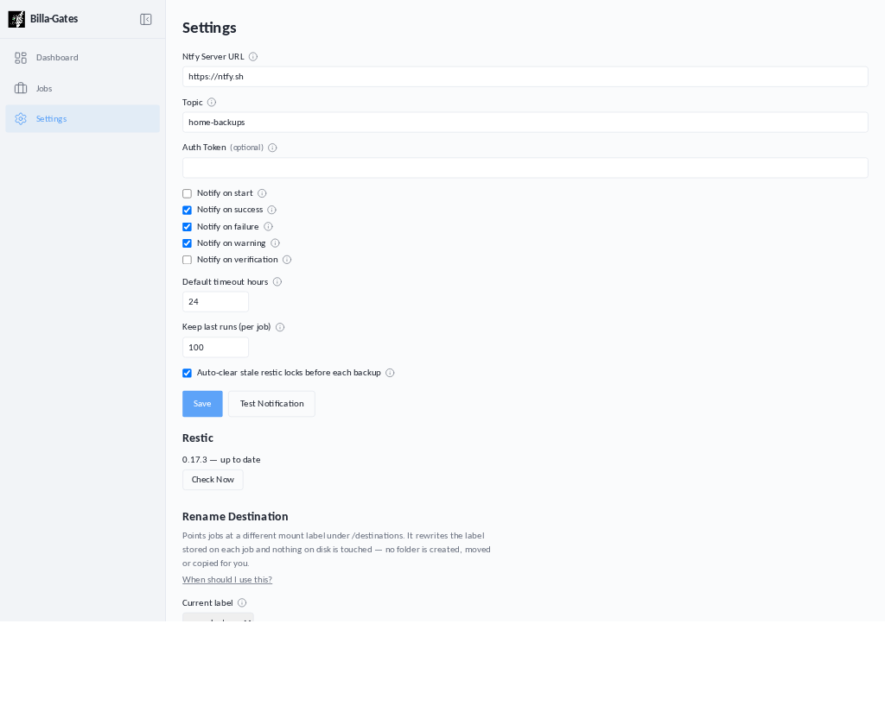

<p align="center">
  
</p>

# Billa-Gates

A self-hosted web UI for scheduled [restic](https://restic.net/) backups — create
backup jobs, run them on a schedule, apply retention, verify integrity, and get
notified.



## Features

- **Scheduled backups** — cron expressions or simple intervals (`6h`, `1d`, `30m`).
- **Retention & pruning** — `forget`/`prune` policies applied after each run.
- **Integrity checks** — optional `restic check` verification per job.
- **Snapshot browsing** — view snapshots and run history in the UI.
- **Notifications** — push run results to [ntfy](https://ntfy.sh/).
- **Single container** — FastAPI serves both the API and the React frontend.

## Screenshots

| Jobs | Job detail | Settings |
| --- | --- | --- |
|  |  |  |

## Quick start

Published images are **arm64 only**. Please feel free to build your own `amd64` image if you need, instructions are in the [deployment.md](deployment.md) file.

```bash
docker run -d \
  --name billa-gates \
  -p 12345:12345 \
  -e TZ=America/New_York \
  -v billa-gates-data:/app/data \
  -v /path/to/back/up:/sources/documents:ro \
  -v /path/to/restic/repo:/destinations/main \
  yash91sharma/billa-gates:latest
```

Then open <http://localhost:12345>.

- **Sources** are mounted read-only under `/sources/{label}` and become selectable in the UI.
- **Destinations** (restic repositories) are mounted under `/destinations/{label}`.
- Application state (SQLite DB + restic cache) lives in `/app/data` — keep it on a volume.

## License

[MIT](LICENSE)
